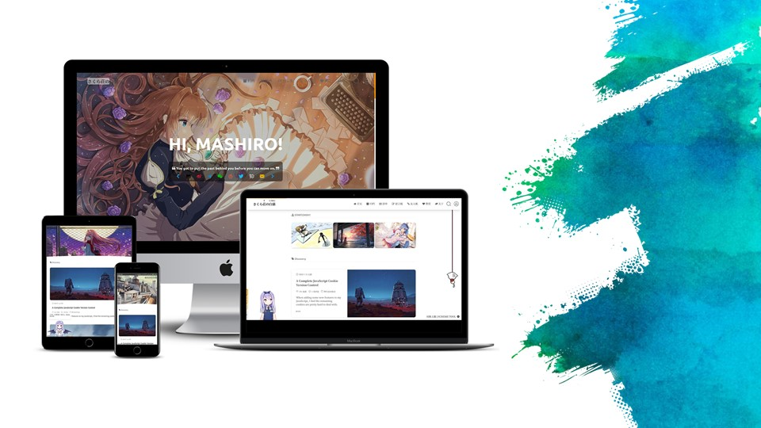

# mySakurairo
## About
A child theme of [Sakurairo](https://github.com/mirai-mamori/Sakurairo)
which is based on [Theme Sakura](https://github.com/mashirozx/sakura).

## Things modified
Use official google fonts api refer `fonts.googleapis.com` instead of other proxy-based ones. 
The official one is also effective in mainland China (verified on 2023.7.31).

The comments area is only available for logged-in users.

The footer link `fuukei.org` is temporarily unavailable (tested on 2023.7.15), I replaced it with `docs.fuukei.org`.

## My Blog
I share some technical tips here (mostly in **_Simplified Chinese_**). 

https://blog.colorfulstage.cn/

